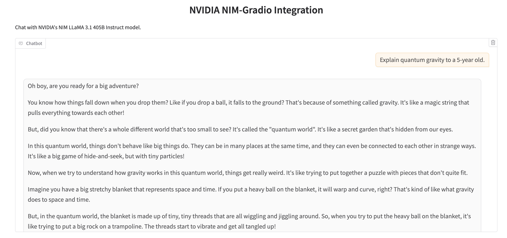

# `nvidia-gradio`

is a Python package that makes it very easy for developers to create machine learning apps that are powered by NVIDIA's NIM API.

# Installation

1. Clone this repo:
   ```bash
   git clone https://github.com/AK391/nvidia-gradio.git
   ```

2. Navigate into the folder that you cloned this repo into:
   ```bash
   cd nvidia-gradio
   ```

3. Install this package:
   ```bash
   pip install -e .
   ```

That's it!

# Basic Usage

Just like if you were to use the `openai` API with NVIDIA NIM, you should first save your NVIDIA API key to this environment variable:

```
export NVIDIA_API_KEY=<your token>
```

Then in a Python file, write:

```python
import gradio as gr
import nvidia_gradio

gr.load(
    name='meta/llama-3.1-405b-instruct',
    src=nvidia_gradio.registry,
).launch()
```

Run the Python file, and you should see a Gradio Interface connected to the model on NVIDIA NIM!


# Customization 

Once you can create a Gradio UI from a NVIDIA NIM endpoint, you can customize it by setting your own input and output components, or any other arguments to `gr.Interface`. For example, the screenshot below was generated with:

```py
import gradio as gr
import nvidia_gradio

gr.load(
    name='meta/llama-3.1-405b-instruct',
    src=nvidia_gradio.registry,
    title='NVIDIA NIM-Gradio Integration',
    description="Chat with Llama 3 405B model.",
    examples=["Explain quantum gravity to a 5-year old.", "How many R are there in the word Strawberry?"]
).launch()
```



# Composition

Or use your loaded Interface within larger Gradio Web UIs, e.g.

```python
import gradio as gr
import nvidia_gradio

with gr.Blocks() as demo:
    with gr.Tab("Llama 3 405B"):
        gr.load('meta/llama-3.1-405b-instruct', src=nvidia_gradio.registry)
    with gr.Tab("Mixtral 8x7B"):
        gr.load('mistralai/mixtral-8x7b-instruct-v0.1', src=nvidia_gradio.registry)

demo.launch()
```

# Under the Hood

The `nvidia-gradio` Python library has two dependencies: `openai` and `gradio`. It defines a "registry" function `nvidia_gradio.registry`, which takes in a model name and returns a Gradio app.

# Supported Models in NVIDIA NIM

| Model | Context Length | Output Length | Dtype / Precision |
|-------|----------------|---------------|-------|
| meta/llama-3.1-405b-instruct | 4096 | Varies | - |
| mistralai/mixtral-8x7b-instruct-v0.1 | 32768 | Varies | - |
| meta/llama2-70b-chat-hf | 4096 | Varies | - |
| anthropic/claude-3-opus-20240229 | 200000 | Varies | - |

-------

Note: if you are getting a 401 authentication error, then the NVIDIA NIM API Client is not able to get the API token from the environment variable. This happened to me as well, in which case save it in your Python session, like this:

```py
import os

os.environ["NVIDIA_API_KEY"] = ...
```